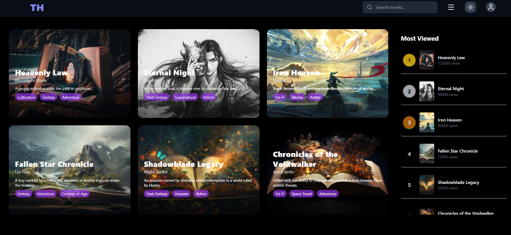
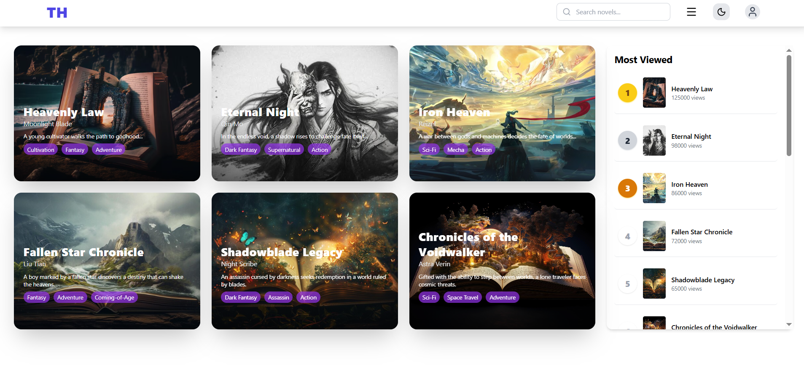
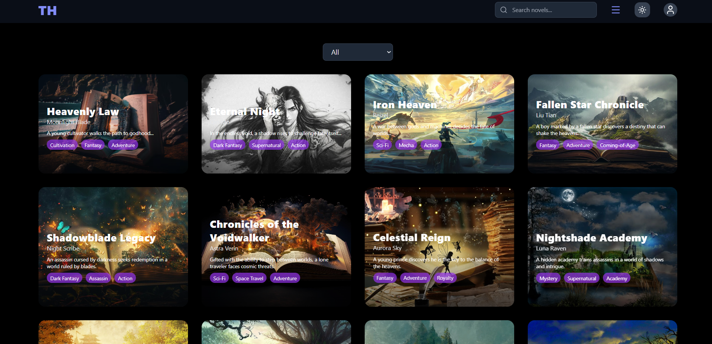
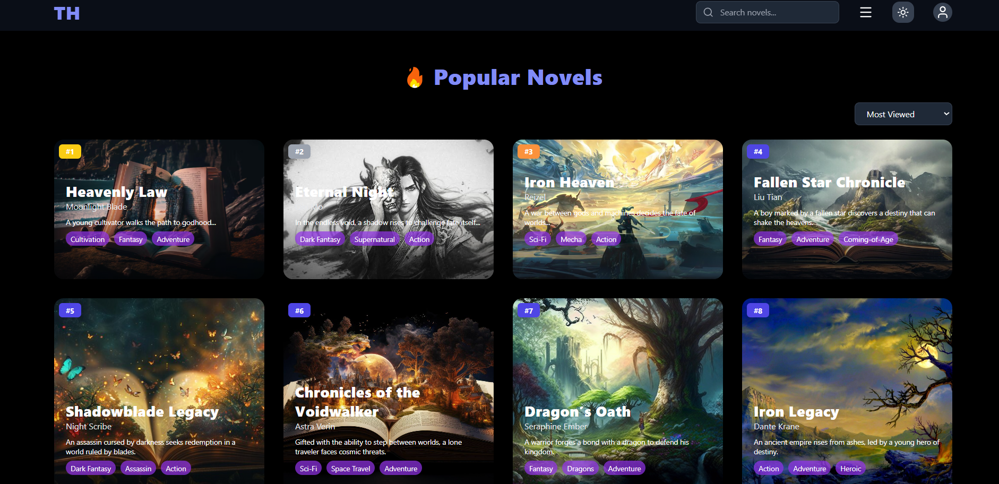

# 📚 Seynovel – Novel Reading Website (Frontend)

A modern, responsive novel reading website built with **React** and **Tailwind CSS**.  
The platform allows users to browse novels, view popular titles, and enjoy an optimized reading experience across devices.  
The UI is designed to be clean, minimal, and accessible with full **light/dark mode support** and **fast navigation** powered by React Router.

---

## 🚀 Features

- 📚 Browse all novels with structured navigation
- ⭐ Popular novels section
- 👤 User profile with avatar support
- 🌙 Light/Dark theme toggle with persistent preference
- 📱 Fully responsive layout for desktop & mobile
- ⚡ Fast SPA routing using React Router
- 🎨 Modern UI powered by Tailwind CSS
- 🧩 Modular, reusable components

---

## 🛠️ Tech Stack

**Frontend**

- React
- Tailwind CSS
- React Router
- Lucide Icons

**Data**

- JSON-based API / static data

**Architecture**

- Component-driven UI
- State management via useState + useEffect

---

## 🧭 Project Goals

- Practice modern frontend development
- Build a user-friendly reading experience
- Explore UI/UX and responsive design
- Learn component-driven architecture

---

## 🧭 Future Improvements

- Authentication
- User reading progress

---

## 📸 Screenshots

### Homepage dark mode

### Homepage light mode

### All novels page

### Popular page

